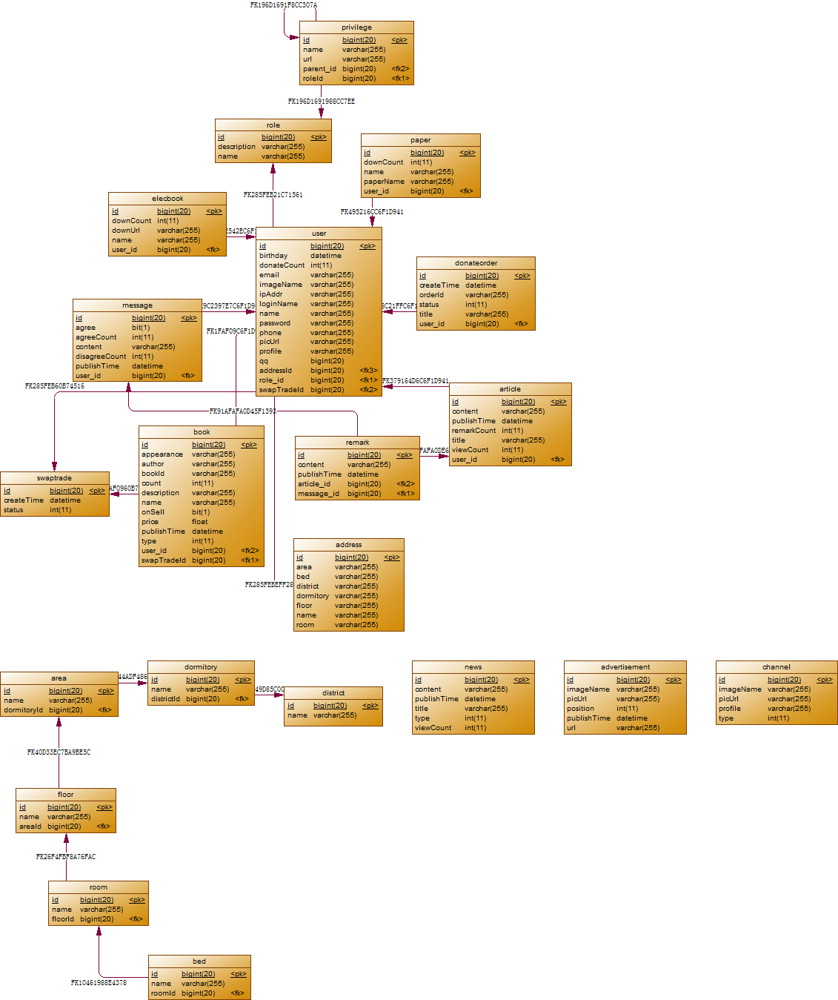

#BookCMS系统简介

##**项目背景**

做这个项目，主要是想锻炼一下自己对于三大框架的使用，结合市场的主流，选择一个以内容为主题的校园旧书交易网。哇，难道是电子商务网站？！！
当然不是，网站提供一个卖家、买家之间交流的一个平台，我们可以通过在上面发售商品，并提供自己的联系方式，既可以通过网络联系，也可以通过
线下联系，商品的交易方式依旧是线下交易，不支持网上支付的功能。
那么，这样一个网站有啥好处呢？

- 卖书，可以上传图书的价格、书籍简介以及卖家的联系方式，买书同样可以。
- 免费专区，每年大四学长、学姐毕业都会留下很多书籍，但是这些书籍都被可惜的丢弃了或者贱卖给了收废品的大叔，免费专区，可以提供一个专门发布免费书籍的地方，让书籍可以重复利用
- 交换专区，顾名思义，可以换书。（后台有交换提醒通知）
- 赠送专区，很多书籍，找不到合适的主人，可以申请将不用的书籍，赠送给图书馆,捐赠人会在前台的爱心榜单展出.
- 悦读专区，可以提供优美的文章供读者使用。
- 电子资源专区，学生可以提供考试试卷、电子书籍等网络资料，以实现共享
- 留言功能
- 新闻功能，展示校园要闻
....
这些功能是目前为止，已经既定下来的，本来打算设计一个在线交流的功能，不过现在这些已经够我做的了,因此将这个系统成为CMS系统（Content Management System，内容管理系统）


##**功能需求**

| 模块| 功能 |
| ------------- |:-------------:|
| **浏览模块**| 新闻管理|
||公告管理|
||悦读管理|
||广告管理|
||爱心榜单|
|**交易模块**|交换书籍|
||购买书籍|
||赠送书籍|
|**互动模块**|留言管理|
||评论管理|
||资源共享管理|
|**权限模块**|初始化权限|
||验证权限|


##**整体设计**

* 表示层：JSP、Struts2
* 业务逻辑层：Spring2.5
* 数据访问层：Hibernate3.6


##**开发工具及涉及技术**

###一、开发环境
* Windows7
* MyEclipse8.5
* Mysql5.5
* Tomcat6.0
* JDK7.0
* Chrome

###二、涉及技术
* Struts2
* Hibernate
* Spring
* junit
* Jquery

##**数据库设计**

###一、创建数据库

` create database bookcms1116 charset utf8; ` 

###二、ER图



###三、数据表含义

| 表名| 字段名 |字段含义|
| ------------- |:-------------:|-------------:|
|**user**|name|姓名|
||loginName|登录名|
||password|密码|
||phone|手机号|
||profile|个人简历|
||qq|QQ号码|
||imageName|图像图片的名字|
||donateCount|捐赠图书数量|
||email|电子邮件|
||ipAddr|ip地址|
||picUrl|图片存储路径|
||addressId|居住地址|
||role_id|角色|
||swapTradeId|交换记录|
|**message**|agree|留言是否赞同|
||agreeCount|赞同数|
||disagreeCount|不赞同数|
||publishTime|发表时间|
||user_id|发表人|
|**remark**|content|评论内容|
||publishTime|发表时间|
||article_id|评论对应的文章|
||message_id|评论对应的留言|
|**article**|content|文章内容|
||publishTime|发表时间|
||remarkCount|评论数|
||title|文章标题|
||viewCount|阅读数量|
||user_id|作者|
|**book**|appearance|书籍外观（几层新）|
||author|书的作者|
||count|书的库存|
||description|简介|
||name|书籍名称|
||price|价格|
||publishTime|出版时间|
||onSell|是否在售|
||type|书的种类|
||user_id|用户|
||swapTradeId|交易记录|
||bookId|书号|


##**5.公共类的设计**

###1、设计BaseDao
	一般有6个方法
	
```
	void save(T entity);//增
	
	void delete(Long id);
	
	void update(T entity);
	
	T getById(Long id);//查
	
	List<T> findAll();
	
	List<T> getByIds(Long []ids);
```

###2、设计BaseDao实现类

>实现上面6个方法
设计BaseDaoImpl实现
	获取T的真实类型：
	使用反射的方法


```
	ParameterizedType pt=this.getClass().getGenericSuperClass();
	clazz=(Class<T>)pt.getActualTypeArguments()[0];
```


##交流与学习

- CSDN Blog:http://blog.csdn.net/wisewolf_life


